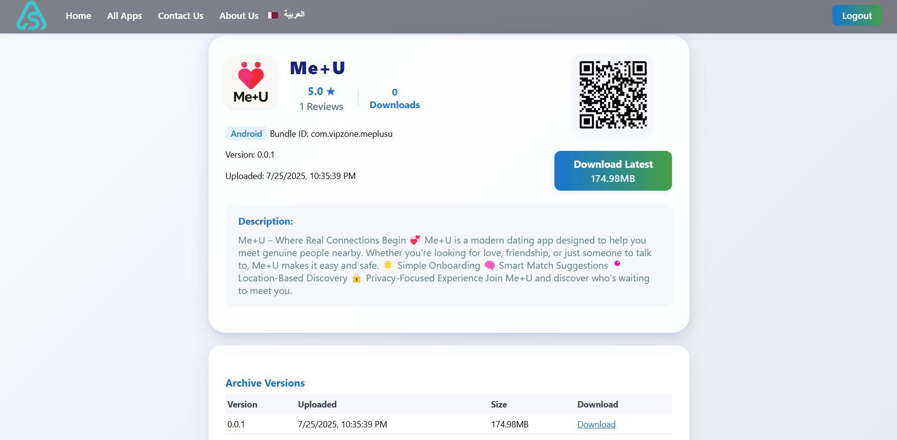
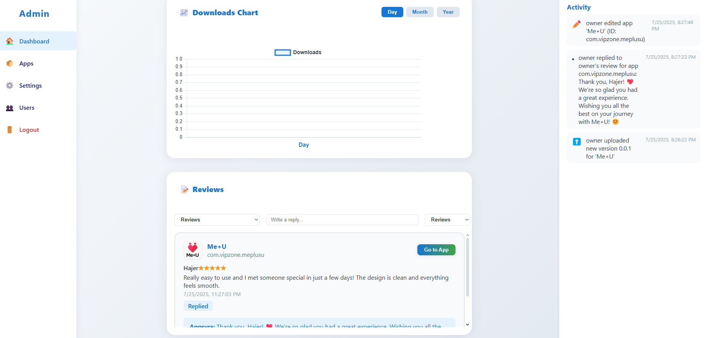
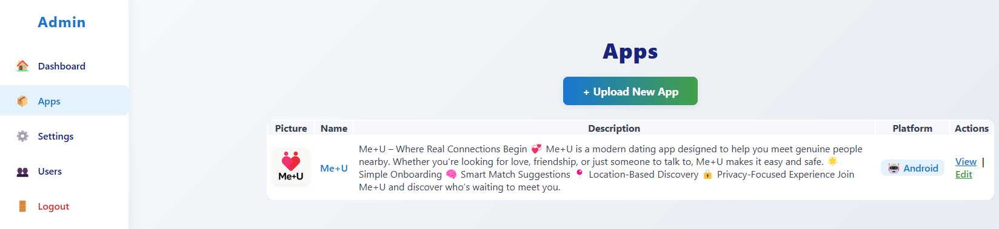
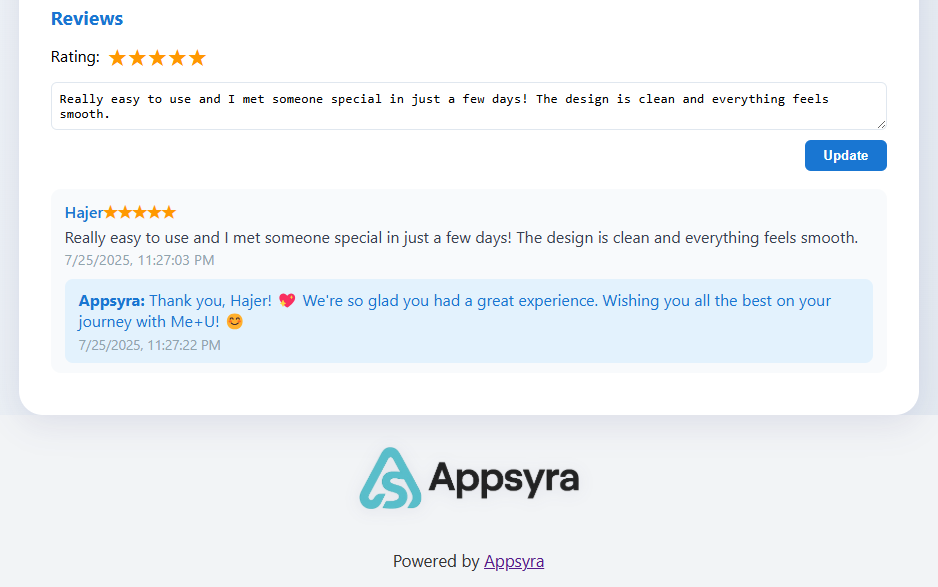

<p align="center">
  
</p>

# Appsyra

A modern, self-hosted app distribution and management platform for iOS and Android.

---

**Open Source Notice**

This project was created by Dhia Bechattaoui for Innova Wide and released as open source for the community.

Inspired by [significa/app-distribution-server](https://github.com/significa/app-distribution-server).

---

## Features
- Upload and manage iOS/Android app builds
- Admin dashboard (login required)
- Version archive and app info pages
- i18n (Arabic/English, RTL/LTR)
- Modern UI with gradient backgrounds
- **Persistent storage via PostgreSQL + Cloudflare R2**
- QR code for easy app download
- User management and reviews system
- Scalable cloud storage for app files

## Quick Start (Docker)

1. **Build the Docker image:**
   ```sh
   docker compose build
   ```
2. **Run with Docker Compose:**
   ```sh
   docker compose up
   ```
3. **Visit the app:**
   - [http://localhost:8000](http://localhost:8000)

## Production Deployment (Render.com + PostgreSQL + Cloudflare R2)

This app is fully configured for production deployment with persistent data storage:

### **Prerequisites:**
- GitHub repository
- Render.com account (free tier)
- Cloudflare account with R2 bucket (free tier)

### **Deployment Steps:**
1. **Fork/Clone this repository**
2. **Set up Cloudflare R2** (optional, for persistent file storage):
   - Create R2 bucket
   - Generate API token with R2 access
   - Get endpoint URL
3. **Deploy to Render:**
   - Connect GitHub repository
   - Render auto-detects `render.yaml` configuration
   - Creates PostgreSQL database automatically
   - Update environment variables with R2 credentials
4. **Your app will have:**
   - ✅ Persistent PostgreSQL database (users, reviews, settings, app metadata)
   - ✅ Cloudflare R2 storage (APK/IPA files)
   - ✅ No data loss on server restarts
   - ✅ Global CDN for file downloads

## Default Secret Key
- The default upload secret is: `UPLOADS_SECRET_AUTH_TOKEN=devtoken`
- Set your own secret in production via environment variable:
  ```sh
  export UPLOADS_SECRET_AUTH_TOKEN=your-strong-secret
  ```

## Environment Variables
- `UPLOADS_SECRET_AUTH_TOKEN` – Secret token for API uploads (default: `devtoken`)
- `LOGO_URL` – Path or URL to logo (default: `/static/logo.png`)
- `APP_TITLE` – App title (default: `Appsyra`)
- `DATABASE_URL` – PostgreSQL connection string (auto-provided by hosting platforms)
- `STORAGE_URL` – Storage configuration (default: `osfs://./uploads`, supports S3/R2)
- `AWS_ACCESS_KEY_ID` – Cloud storage access key (for S3/R2)
- `AWS_SECRET_ACCESS_KEY` – Cloud storage secret key (for S3/R2)
- `AWS_ENDPOINT_URL` – Custom endpoint for Cloudflare R2

## Data Persistence
- **PostgreSQL Database**: User accounts, reviews, settings, and app metadata
- **Cloudflare R2 Storage**: App files (APK/IPA) with global CDN
- **Docker Volumes** (local development): 
  - `app_static` → `/app/static`
  - `app_uploads` → `/app/uploads`

## Security Notes
- **Change the default admin password and secret key before production.**
- Expose only necessary ports.

## License
MIT 

## First-Time Setup: Admin Access

### **Default Admin Credentials:**
- **Username:** `owner`
- **Password:** `owner123`
- **Role:** `owner`

> **⚠️ IMPORTANT:** Change these credentials in production via the admin dashboard!

### **Access Steps:**
1. **Visit your deployed app** (e.g., https://appsyra.bechattaoui.dev)
2. **Go to `/login`**
3. **Use default credentials above**
4. **Access admin dashboard** at `/admin`
5. **Create additional users** and **change default password**

### **Database Auto-Setup:**
- PostgreSQL tables are created automatically on first startup
- Default owner user is created if no users exist
- All user data is securely stored in PostgreSQL 

## App Screenshots

<p align="center">
  
</p>

<p align="center">
  
</p>

<p align="center">
  
</p>

<p align="center">
  
</p>

## Community Standards
See our [Code of Conduct](CODE_OF_CONDUCT.md) and [Contributing Guidelines](CONTRIBUTING.md) to help keep this project welcoming and collaborative.

## Cloud Deployment

### Render.com (Recommended)
This app is configured for easy deployment on Render.com with PostgreSQL database:

1. **Push to GitHub**
2. **Connect to Render.com**
3. **Deploy using `render.yaml`** (auto-detected)
4. **Set up Cloudflare R2** for persistent file storage (optional but recommended)

See [DEPLOYMENT_OPTIONS.md](DEPLOYMENT_OPTIONS.md) for detailed deployment guides for multiple platforms.

### Prerequisites for Production
- PostgreSQL database (auto-provided by Render)
- Cloudflare R2 bucket (for persistent file storage)
- Custom domain configuration

## How to Contribute
We welcome contributions! Please read [CONTRIBUTING.md](CONTRIBUTING.md) for guidelines before submitting a pull request. 